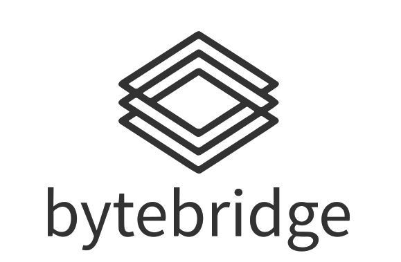

<p align="center" style="padding: 20px">
  
</p>

<p align="center" style="padding-bottom: 20px">
    <em>A data tool designed to move data seamlessly between various sources and destinations.</em>
</p>

## Command Line Interface


### Extracting using SQL queries

```bash
bytebridge transfer 
    --source postgres 
    --query extraction_query.sql 
    --destination parquet 
    --map "ColumnA:column_a,ColumnB:column_b" 
```


## Data Interfaces

### Currently Supported

| Name             | Type          |
|----------------- | --------------|
| PostgreSQL       | Database      |
| Parquet          | File          |


### Planned

| Name             | Type          |
|----------------- | --------------|
| MySQL            | Database      |
| SQLite           | Database      |
| SQL Server       | Database      |
| Oracle           | Database      |
| Clickhouse       | Database      |
| Parquet          | File          |
| CSV              | File          |
| ORC              | File          |
| Avro             | File          |
| Excel (XLSX)     | File          |


## Contributing

Feel free to contribute to this project. See the contribution guidelines in [here](CONTRIBUTING.md).

## License

This project is licensed under the terms of the [Apache 2.0 license](LICENSE).